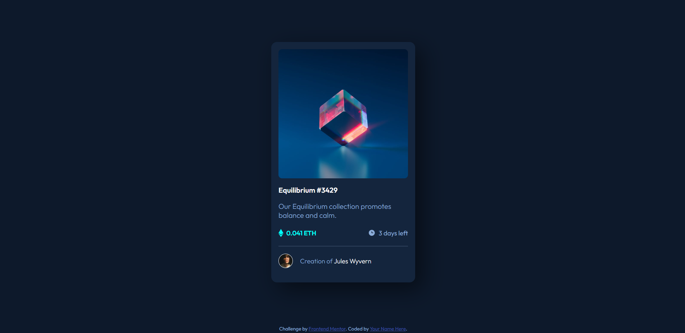

# NFT Preview Card Component 👨‍💻

## Project Overview 🌟

This is a front-end coding challenge completed for [Frontend Mentor](https://www.frontendmentor.io). The challenge was to build a product preview card component and make it look as close to the provided design as possible.

## Technologies Used 💻

- HTML
- CSS

## Features ✨

- Responsive design that adapts to different screen sizes.
- Hover and focus states for interactive elements.
- Uses semantic HTML for better accessibility.
- Styled using CSS with a consistent and modern design.

## Screenshots 📷

## Live Demo 🚀

You can view the live demo of the project [NFT Preview Card Component](https://nft-preview-card-component-004.netlify.app/).